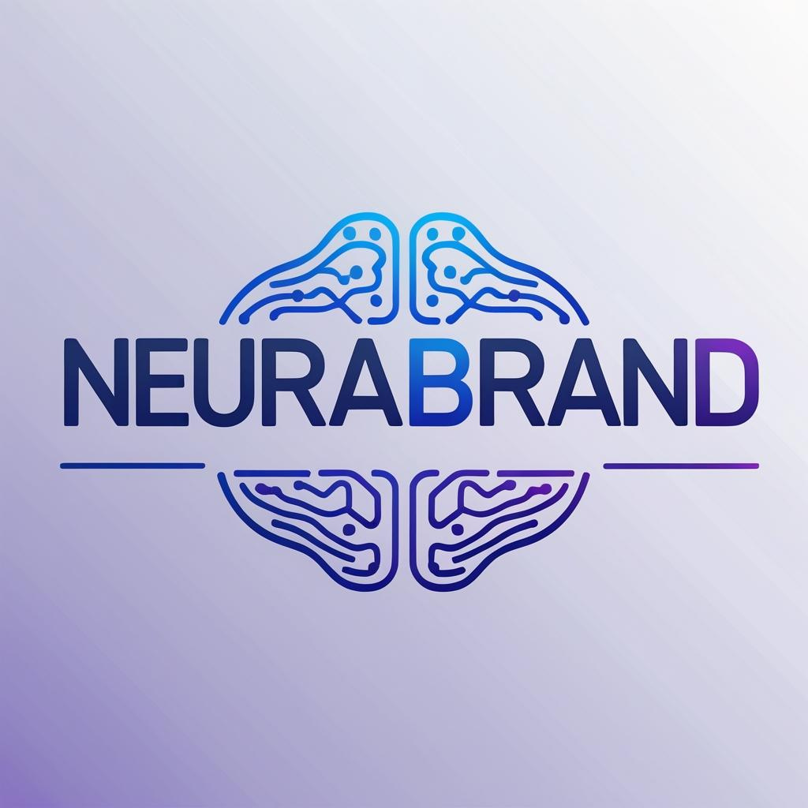
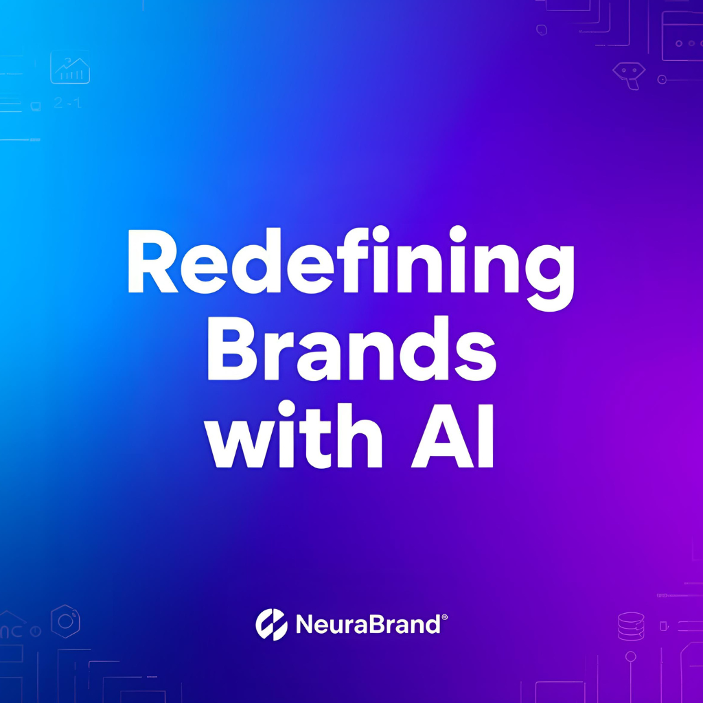
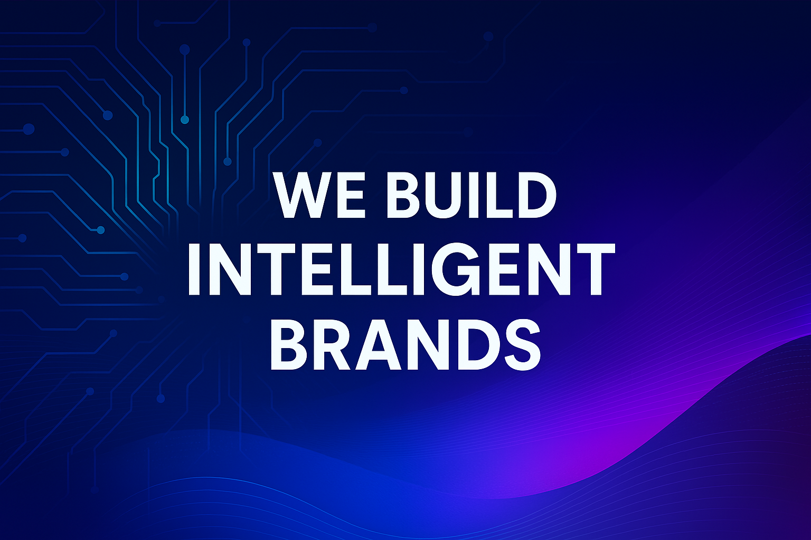

# 🚀 AI-Powered Digital Branding Agency (Assignment)

This repository contains my submission for the **AI-Powered Digital Branding Agency** assignment.  
The project demonstrates how AI tools like ChatGPT and Canva Magic Media can be used to create branding assets, marketing content, and client outreach strategies.  

---

## 📌 Objectives
By the end of this project, I aimed to:
- Understand the role of AI in branding & digital marketing.  
- Use ChatGPT to generate branding stories, taglines, and marketing copy.  
- Use Canva Magic Media to design logos, social media graphics, and marketing materials.  
- Develop a structured branding approach for startups and small businesses.  
- Apply client outreach and monetization strategies to build a profitable agency model.  

---

## Phase 1: Branding & Business Setup
**Business Name:** NeuraBrand  
**Tagline:** *“AI-crafted branding for tomorrow’s leaders”*  
**Mission:** Empower startups and small businesses with affordable, AI-powered branding.  

**Brand Story:**  
In today’s fast-paced digital world, startups often struggle to stand out. That’s where **NeuraBrand** comes in. We combine the power of artificial intelligence with human creativity to craft unique, future-ready branding solutions. From logos and social media visuals to website design and ad copy, our AI-powered agency helps businesses tell their story with clarity, speed, and impact. We don’t just design brands—we engineer digital identities that evolve with the market. For ambitious startups looking to make their mark, NeuraBrand is the bridge between vision and visibility.  

---

## Phase 2: AI-Generated Design & Marketing Content
✅ **Social Media Posts (Sample Ideas)**  
- “Your brand deserves to shine—let AI design your future. 🚀 #NeuraBrand”  
- “Stop blending in. Start standing out. AI branding built for startups. 🌟 #DigitalFuture”  
- “Smart design. Bold impact. That’s NeuraBrand. 💡 #AIbranding”  
- “Why spend weeks on branding when AI can do it in minutes? Try NeuraBrand today. ⏱️”  
- “The future of branding is here. Are you ready? 🔥 #FutureBranding”  

✅ **Website Mockup (Concept)**  
- **Homepage:** Hero banner introducing NeuraBrand, CTA button (“Get Your AI Branding Today”), and client success highlights.  
- **Services Page:** Clear sections for Logo Design, Social Media Kits, Website Templates, and AI Copywriting.  

✅ **Blog Post (Excerpt)**  
**Why Businesses Should Use AI-Powered Branding**  
In today’s competitive digital space, businesses that adopt AI branding gain an edge. AI delivers speed, personalization, and cost-efficiency—allowing startups to access creative designs once reserved for big companies. By leveraging AI, your brand can adapt to trends faster, maintain consistency, and scale with ease.  

---

## Phase 3: Client Outreach & Monetization
✅ **Sales Pitch Email (Sample)**  
**Subject:** Elevate Your Brand with AI-Powered Design 🚀  

Hello [Client Name],  

In today’s fast-paced market, standing out is harder than ever. That’s why we built **NeuraBrand**—an AI-powered branding agency that creates logos, content, and marketing assets in a fraction of the time and cost of traditional agencies.  

We’d love to show you how AI-driven branding can give your business a competitive edge. Let’s set up a quick call to discuss your goals and how NeuraBrand can help you achieve them.  

Looking forward to connecting,  
[Your Name]  
*NeuraBrand Team*  

✅ **Pitch Deck (Concept)**  
- **Slide 1:** Title — “AI-Powered Branding for Startups”  
- **Slide 2:** Problem — “Startups struggle to stand out in noisy markets”  
- **Slide 3:** Solution — “AI-driven logos, content, and websites that are fast & affordable”  
- **Slide 4:** Services — Logos, Social Kits, Websites, Copywriting  
- **Slide 5:** Call to Action — “Let’s build your brand together”  

---

## 🎨 Assets  
   
   
   
 [📑 Pitch Deck PDF](./assets/pitch-deck.pdf)  

---

## 📂 Project Structure  
ai-branding-agency → [ README.md, assets/ (logo, social post, banner, pitch deck) ]  

---

## ✅ Final Note
This project showcases how AI can transform branding into a faster, smarter, and more creative process. By combining **ChatGPT** and **Canva Magic Media**, startups and small businesses can access high-quality branding that was once out of reach.
